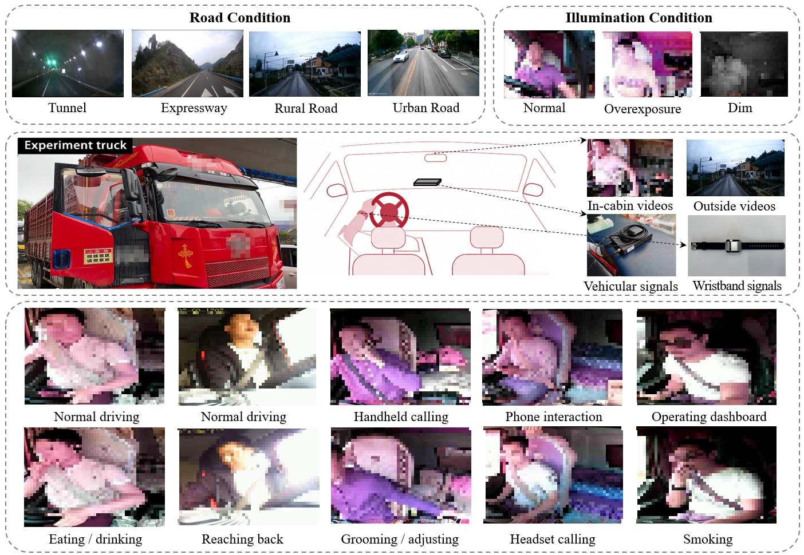
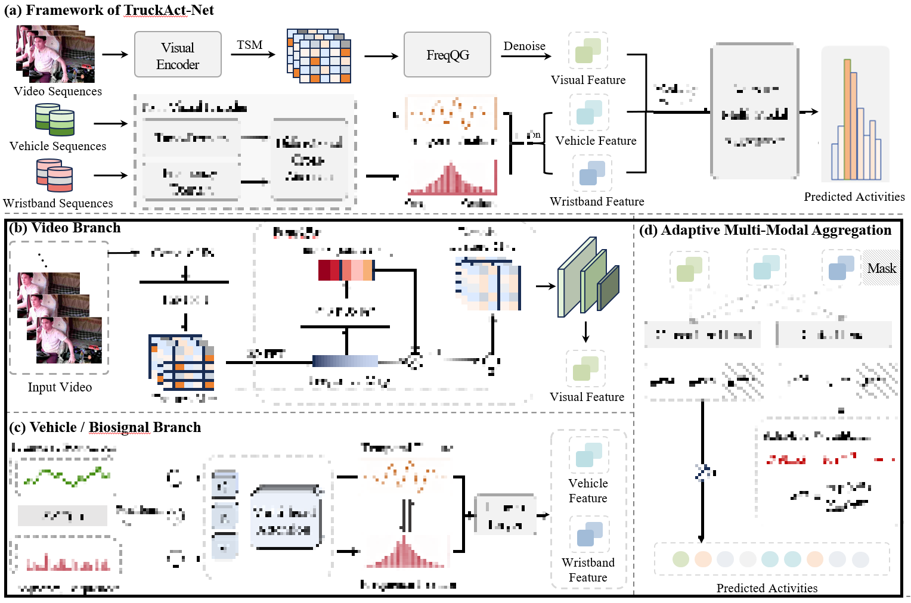

 # TruckAct: A multi-source, multimodal dataset for real-world truck driver activity recognition

This is the official repository for the paper: **"TruckAct: A multi-source, multimodal dataset for real-world truck driver activity recognition"**.

## 📢 News
* The complete training and inference code for **TruckAct-Net** will be released upon official publication.**Coming Soon！！！**
* **Coming Soon**: Pre-trained models and detailed configuration files for the FreqQG and TF-Former modules.**Coming Soon！！！**

---

## 📂 Dataset Overview
**TruckAct** is the first naturalistic, multi-source, and multimodal dataset dedicated specifically to professional truck driver activity recognition.

### Key Statistics:
* **Scale**: ~67 hours of synchronized data from 62 long-haul trips.
* **Subjects**: 9 professional truck drivers operating under real-world conditions without any artificial intervention.
* **Modalities**:
    * **Visual**: In-cabin RGB videos ($1280 \times 720$, 25 FPS).
    * **Vehicular**: Telemetry including speed, tri-axial acceleration, GPS, etc. (5 Hz).
    * **Physiological**: Wearable wristband signals including HR, GSR, and PPG (5 Hz).
* **Annotations**: 24,000 non-overlapping 10-second clips across 9 activity classes.

### Visual Examples:
  
*Figure 1: Overview of the TruckAct dataset and the nine annotated activity classes.*

---

## 📥 Download Link
You can download the full data package **[HERE](你的GoogleDrive链接)**.

The package includes:
1. Processed kinematic and geometric descriptors (Vehicle signals).
2. Denoised physiological feature sequences (Wristband signals).
3. Sample anonymized video frames.

---

## 🧠 Methodology: TruckAct-Net
TruckAct-Net is a multi-stream, hierarchical framework tailored for long-haul truck monitoring.


*Figure 2: The architecture of TruckAct-Net.*

---

## 📩 Contact
For any questions regarding the dataset or code, please contact:
* **Qianfang Wang**: qianfangwang@163.com

## 📄 Citation
If you find our work useful, please cite:
```latex
@article{wang2026truckact,
  title={TruckAct: A multi-source, multimodal dataset for real-world truck driver activity recognition},
  author={Wang, Qianfang and Rao, Bin and Pei, Xin and Xu, Pengpeng and Chen, Tiantian},
  journal={arXiv},
  year={2026}
}

